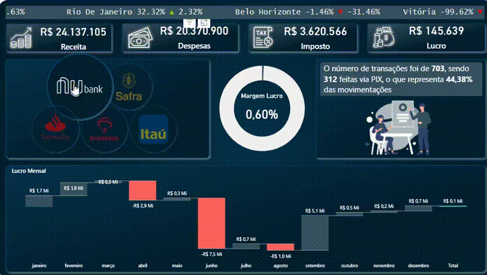

# 💳 Dashboard Financeiro — Power BI

**Stack:** Power BI (Modelo de Dados, DAX, Relatório Interativo)
**Base de dados:** Excel — 2.725 movimentações financeiras (jan/2020 a dez/2021)
**Objetivo:** Monitorar recebimentos e pagamentos por banco, forma de pagamento, município e período — apoiando a gestão financeira com visão consolidada e interativa

---

## 📖 O Contexto

Este projeto analisa 2 anos de movimentações financeiras de uma empresa com **264 clientes distintos** em **4 municípios** (São Paulo, Belo Horizonte, Rio de Janeiro e Vitória), operando com **5 bancos** e **4 formas de pagamento**. O objetivo foi construir um relatório no Power BI que centralize os indicadores financeiros e permita à gestão acompanhar o fluxo de caixa por múltiplas dimensões.

---

## 🗂️ Estrutura dos Dados

| Campo | Descrição |
|---|---|
| Numero Movimentacao | Identificador único de cada transação |
| Nome | Cliente envolvido na movimentação |
| Município | Cidade do cliente (SP, BH, RJ, Vitória) |
| Data da Movimentacao | Data da transação |
| Valor da Movimentação | Valor em reais |
| Tipo | Recebimento ou Pagamento |
| Banco | Banco utilizado (Itaú, Nubank, Bradesco, Safra, Santander) |
| Forma Pagamento | Pix, Boleto, Cartão ou MercadoPago |

---

## 📊 Principais KPIs

### 💰 Visão Geral (2020-2021)

| Indicador | Valor |
|---|---|
| Total de movimentações | 2.725 registros |
| Clientes únicos | 264 |
| Total de recebimentos | R$ 94.602.866,94 |
| Total de pagamentos | R$ 44.863.840,92 |
| Saldo líquido | R$ 49.739.026,02 |
| Ticket médio de recebimento | R$ 55.845,85 |
| Ticket mediano de recebimento | R$ 11.016,01 |

**Insight:** A diferença entre o ticket médio (R$ 55.845) e o ticket mediano (R$ 11.016) é **5x** — sinal claro de que poucos recebimentos de alto valor distorcem a média. A mediana representa melhor o "cliente típico" dessa base.

---

### 🏦 Recebimentos por Banco

| Banco | Total | Participação |
|---|---|---|
| Itaú | R$ 33.261.602,80 | 35,2% |
| Nubank | R$ 24.137.104,56 | 25,5% |
| Santander | R$ 17.406.979,81 | 18,4% |
| Safra | R$ 12.392.384,20 | 13,1% |
| Bradesco | R$ 7.404.795,57 | 7,8% |

**Insight:** Itaú e Nubank juntos concentram **60,7%** de todos os recebimentos. Bradesco, apesar de ser um dos maiores bancos do país, representa apenas 7,8% do fluxo — menor que o Safra.

---

### 💳 Recebimentos por Forma de Pagamento

| Forma de Pagamento | Total | Participação |
|---|---|---|
| Pix | R$ 47.643.312,41 | 50,4% |
| Cartão | R$ 20.632.350,53 | 21,8% |
| Boleto | R$ 14.191.188,00 | 15,0% |
| MercadoPago | R$ 12.136.016,00 | 12,8% |

**Insight:** O **Pix representa mais da metade** (50,4%) de todos os recebimentos — consolidado como principal meio de pagamento já em 2020-2021, período logo após seu lançamento (nov/2020). MercadoPago (12,8%) supera Boleto em relevância, refletindo a digitalização dos pagamentos.

---

### 🗺️ Recebimentos por Município

| Município | Total Recebido |
|---|---|
| São Paulo | R$ 27.425.098,10 |
| Belo Horizonte | R$ 24.044.409,59 |
| Rio de Janeiro | R$ 21.635.781,62 |
| Vitória | R$ 21.497.577,63 |

**Insight:** A distribuição entre os 4 municípios é surpreendentemente equilibrada — Vitória (R$ 21,5M) fica apenas R$ 138 mil abaixo do Rio de Janeiro (R$ 21,6M), mesmo sendo uma capital menor. Isso pode indicar concentração de grandes clientes nessa praça.

---

### 📅 Evolução Anual

| Ano | Recebimentos |
|---|---|
| 2020 | R$ 53.380.997,97 |
| 2021 | R$ 41.221.868,97 |

**Insight:** Queda de **22,8%** nos recebimentos de 2020 para 2021 — vale investigar se está relacionado a sazonalidade, perda de clientes ou base de dados incompleta em 2021 (o período vai só até dezembro/2021).

---

## 🧠 Sobre as Habilidades Aplicadas

Nível: **intermediário em Excel e Power BI** — tratamento e modelagem de base de dados financeira, construção de indicadores de fluxo de caixa (recebimentos, pagamentos, saldo) e visualização interativa em relatório. Aplicado por meio de modelo de dados no Power BI com filtros dinâmicos por banco, forma de pagamento, município e período, além de KPIs calculados via DAX.

---

## 🎥 Demonstração



---

## 📁 Estrutura do Projeto

```
Dashboard-Financeiro-PowerBI/
├── Base_Financeiro.xlsx   # Base com 2.725 movimentações financeiras
├── dashboard.gif          # Demonstração do relatório interativo
└── README.md              # Este arquivo
```

---

## 🚀 Como Reproduzir

1. Baixe o arquivo `Base_Financeiro.xlsx`
2. Importe no Power BI Desktop (Obter Dados → Excel)
3. Construa as medidas DAX para os KPIs (total recebido, total pago, saldo, ticket médio)
4. Crie os visuais de barras, cartões de KPI e filtros por banco/forma de pagamento/município

---

📫 **Contato:** [LinkedIn](https://www.linkedin.com/in/simaosantana-a744372a7) · simaojoaosantana@gmail.com
